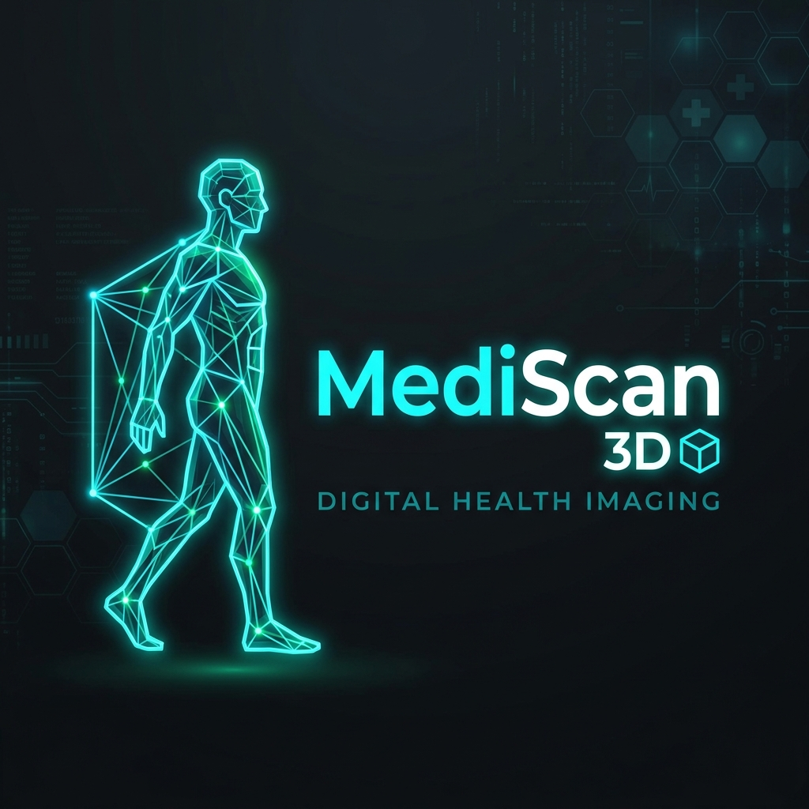
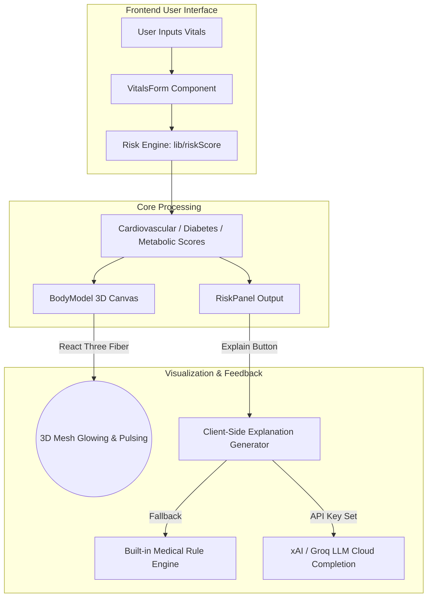

<div align="center">
  
</div>

<div align="center">
  
  <h1>MediScan 3D — Interactive Health Risk Visualizer</h1>
  <p><em>A modern, interactive Next.js web application that visualizes personal health risk factors in 3D.</em></p>
</div>

---

## 🌟 Overview

MediScan 3D allows users to enter basic vitals (age, BMI, blood pressure, glucose, cholesterol) and see a procedural 3D human body model where organs and regions dynamically light up and pulse based on calculated health risk scores.

An intelligent clinical analysis panel explains the assessment using a built-in rule-based screening engine with support for **xAI/Grok AI completions** (or Groq AI).

## 🩺 3D Humanoid Body Model Engine

The core differentiator of MediScan 3D is its interactive, procedural **Three.js** canvas built using **React Three Fiber (R3F)** and **@react-three/drei**. It constructs a virtual representation of the patient's body and maps calculated clinical risk scores directly onto physical geometric segments.

### 📐 3D Scene Architecture & Layout
The 3D model is composed of procedural geometries carefully arranged to resemble a human form:

```text
       [ Head ] ------------ Sphere (0.35r) @ [0, 2.2, 0] - Baseline reference (Blue-gray)
       /  |  \
  [Arms]  |  [Arms] -------- Cylinders (0.15r x 0.9h) - Aesthetic support
     \ [Torso] / ----------- Cylinder (0.4r x 1.2h) @ [0, 0.8, 0] - CARDIOVASCULAR RISK
          |
    [Midsection] ----------- Cylinder (0.42r x 0.5h) @ [0, 0.2, 0.1] - DIABETES / METABOLIC RISK
         / \
      [Legs] [Legs] -------- Cylinders (0.18r x 1.2h) - Aesthetic support
```

### 💡 Lighting & Camera Setup
- **Camera:** Configured with a Field of View (FOV) of `50` and positioned at `[0, 0, 3.5]`.
- **Ambient Light:** Soft `0.6` intensity baseline illumination to prevent total shadows.
- **Key Point Light:** Set at `[5, 5, 5]` with an intensity of `0.8` to cast highlights.
- **Accent Point Light:** Cyan-tinted (`#06b6d4`) point light at `[-5, -5, 5]` with `0.4` intensity to create a professional medical/cyberpunk laboratory aesthetic.
- **Accents:** A subtle transparent floating background sphere (`#06b6d4` with `0.2` opacity) provides spatial depth.

### 🎨 Color & Emissive Pulsing Algorithms
Risk levels are visually mapped onto segment colors using custom `MeshPhongMaterial` shaders:
* 🟢 **Green (`#10b981` / Low Risk: 0-25):** Safe, healthy baseline.
* 🟡 **Yellow (`#f59e0b` / Moderate Risk: 26-50):** Warning state. Focus on preventive measures.
* 🔴 **Red (`#ef4444` / High Risk: 51-100):** Visual alert state.

#### 💓 Pulsing Glow Effect
When a calculated risk score crosses the high-risk threshold (> 50), an emissive glowing animation is activated inside R3F's rendering loop (`useFrame`):
```typescript
const pulseIntensity = 0.8 + Math.sin(Date.now() * 0.004) * 0.2;
(torsoRef.current.material as any).emissive.setHex(
  parseInt(torsoColor.slice(1), 16) * (pulseIntensity * 0.3)
);
```
- **Torso (Cardiovascular Risk):** Responds to blood pressure, age, and cholesterol. Emissive glow pulses using the raw sine wave.
- **Midsection (Diabetes & Metabolic Risk):** Responds to BMI, age, and glucose. Emissive glow pulses **out-of-phase** (shifted by `Math.PI` / 180 degrees) from the torso to create a realistic, asynchronous bio-rhythmic feel.

### 🎮 User Interactions
- **Orbit Controls:** Users can drag to orbit, scroll to zoom, and right-click to pan around the humanoid model.
- **Bi-directional Rotation:** The model auto-rotates around its Y-axis at a constant speed of `2`.
- **Hover Stabilization:** The rotation pauses automatically when the cursor hovers over the model, allowing detailed inspection of specific regions. This is achieved via pointer events mapping to group `userData.isInteracting`.

## 🏗️ System Architecture & Data Flow



### Key Modules
* **[components/BodyModel.tsx](components/BodyModel.tsx):** Interactive 3D humanoid scene using React Three Fiber, OrbitControls, and custom phong materials.
* **[components/RiskPanel.tsx](components/RiskPanel.tsx):** Calculates progress gauges and generates client-side AI and rule-based explanations.
* **[lib/riskScore.ts](lib/riskScore.ts):** Centralized health formula using standard clinical screening thresholds.

## 🚀 Tech Stack

- **Frontend Framework:** [Next.js 14](https://nextjs.org/) (Static Export mode)
- **3D Graphics:** [Three.js](https://threejs.org/), [React Three Fiber (R3F)](https://docs.pmnd.rs/react-three-fiber), `@react-three/drei`
- **Styling:** [Tailwind CSS 3](https://tailwindcss.com/) (Dark clinical theme)
- **Forms & Validation:** [React Hook Form](https://react-hook-form.com/) + [Zod](https://zod.dev/)

## 💻 Local Development

### Prerequisites
* Node.js 18+
* pnpm 9+

### Setup Instructions

1. **Install dependencies:**
   ```bash
   pnpm install
   ```

2. **Configure environment (Optional):**
   Copy `.env.local.example` to `.env.local` and add your AI API key (supports xAI / Groq depending on your setup):
   ```env
   NEXT_PUBLIC_GROQ_API_KEY=your_api_key_here
   ```
   *If no key is configured, the application automatically falls back to the local built-in medical explanation engine.*

3. **Start local development:**
   ```bash
   pnpm dev
   ```
   Open [http://localhost:3000](http://localhost:3000) in your browser.

## ☁️ Deployment

Since the app is configured as a static export, you can easily deploy it to platforms like Vercel, Render, or GitHub Pages.

### Publish Directory
When deploying to platforms that require a publish directory for static builds, the output is typically `out` (for Next.js static exports configured in `next.config.js`) or `.next`.
*If using standard Vercel hosting, the platform automatically detects Next.js and requires zero configuration.*

## ⚖️ Clinical Disclaimer

> **⚠️ IMPORTANT:** This tool is a **screening prototype for educational and demonstration purposes only**. It is **not a medical diagnostic device** and does not replace professional medical advice. Always consult a licensed healthcare professional for any medical concerns or treatment decisions.
